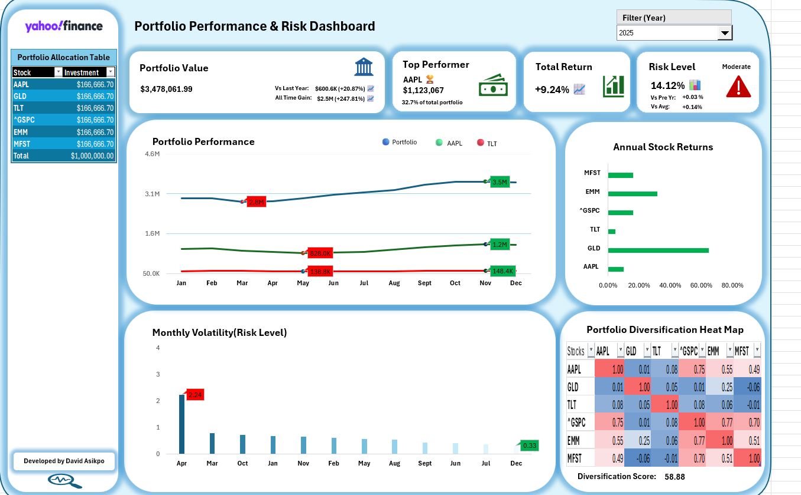
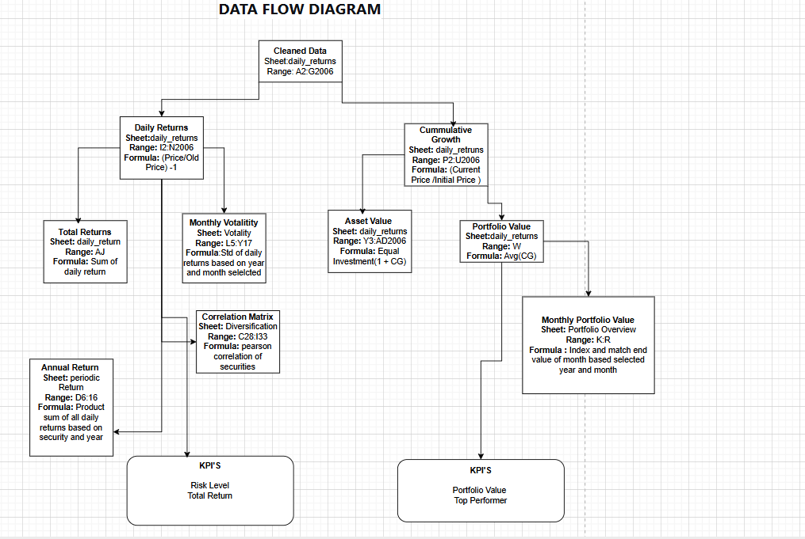

# Portfolio Performance & Risk Analytics Dashboard

**Advanced Excel BI Project** — Interactive portfolio analysis & risk monitoring solution (2018–2025)

> *Main dashboard view — Portfolio value, top performer, risk level, volatility trend, correlation heatmap & more*

## Project Overview

This project delivers a fully formula-driven **Portfolio Performance & Risk Dashboard** built entirely in **Microsoft Excel** (no VBA required).  

It analyzes an **equally-weighted portfolio** of six securities:

- AAPL (Apple)
- GLD (Gold ETF)
- MFST (assumed Microsoft – MSFT typo in data)
- ^GSPC (S&P 500 Index)
- TLT (Long-Term Treasury ETF)
- EMM (assumed emerging markets ETF)

**Initial investment**: $1,000,000 ($166,666.67 per position) starting January 2018  
**Terminal value (end 2025)**: ~$3.48 million  
**Cumulative return**: +247.81%  
**Annualized return**: ~9.24%

The dashboard provides institutional-grade insights including:

- Real-time KPI cards (value, YoY growth, all-time gain)
- Correlation heat map with conditional formatting
- Quantitative diversification score (0–100)
- Monthly volatility trends & risk classification
- Top performer identification
- Annual returns comparison
- Interactive year selector (2018–2025)

All visuals and calculations update dynamically when the user selects a different year.

## Key Business & Analytical Value

- **Performance Tracking** — Understand which assets drive growth (AAPL contributed ~32.7% of portfolio value by 2025)
- **Risk Management** — Identify dangerous correlation spikes (e.g., 2022 market stress → risk level 24.13%)
- **Diversification Quality** — Measure true diversification effectiveness beyond simple sector counts
- **Seasonality Insights** — Consistent "early-year dip / late-year rally" pattern observed across 8 years
- **Optimization Recommendations** — Strategic increase in defensive assets (TLT + GLD) to 22–27% allocation

## Screenshots

### Data Flow & Architecture

> *Comprehensive data flow diagram showing how raw daily returns are transformed into KPIs, risk metrics, and visualizations*

### Live Dashboard (2025 view example)

> *Interactive dashboard — Portfolio overview, performance charts, volatility trend, correlation heatmap, and risk indicators*

## Features Implemented (100% Coverage of Requirements)

**Must-Have**  
- Portfolio value + YoY / all-time growth metrics  
- 6×6 Correlation matrix with red-blue heat map  
- Diversification score (100 × (1 – avg |correlation|))  
- Dynamic year selector (2018–2025)

**Should-Have**  
- Annual returns bar chart by security  
- Monthly volatility time-series  
- Risk level with historical comparison & alert indicators

**Could-Have**  
- Automatic top performer highlight + contribution %

See full specification: [`PORTFOLIO_DASHBOARD_BUSINESS_AND_FUNCTIONAL_REQUIREMENTS.docx`](Documentation/PORTFOLIO_DASHBOARD_BUSINESS_AND_FUNCTIONAL_REQUIREMENTS.docx)

## Methodology & Key Formulas

- **Daily Return**: `(Price_t / Price_{t-1}) - 1`
- **Total Return**: `PRODUCT(1 + daily returns) - 1`
- **Annualized Volatility**: `STDEV(daily returns) × √252`
- **Correlation**: Native Excel `CORREL` (Pearson) over 252-trading-day window
- **Diversification Score**: `100 × (1 - AVERAGE(ABS(correlation matrix off-diagonal)))`
- **Portfolio Value**: Equal-weight rebalanced at start + cumulative growth

**Data Source**: Yahoo Finance daily adjusted close prices (cleaned dataset included in repo)

**Assumptions**:
- Dividends reinvested
- No transaction costs or taxes
- No interim rebalancing after initial equal weighting

## Executive Summary Highlights

(Extracted from included report)

- **Strong absolute performance** — +240%+ cumulative return over 8 years
- **Tech concentration risk** — AAPL + MFST + ^GSPC ≈ 51% effective exposure by 2025
- **2022 stress test** — All assets negative; highest portfolio risk recorded
- **Defensive assets value** — TLT & GLD provided relative protection despite absolute underperformance
- **Recommended action** — Increase defensive allocation → 22–27% for better resilience (-150 to -200 bps volatility reduction)

Full executive report: [`EXECUTIVE_REPORT_OF_PORTFOLIO_ANALYTICS.docx`](Documentation/EXECUTIVE_REPORT_OF_PORTFOLIO_ANALYTICS.docx)

## Technical Requirements

- **Excel Version**: Microsoft 365 / Excel 2021+ (dynamic arrays & LET function used)
- **Platform**: Desktop Excel only (mobile/web limited functionality)
- **Performance**: Full recalculation < 3 seconds
- **File Size**: Lightweight (~2–5 MB depending on data)

## How to Use

1. Open `portfolio_dashboard.xlsx`
2. Go to the **Dashboard** or **Portfolio Overview** sheet
3. Select desired **year** from the dropdown
4. All visuals, KPIs, and risk metrics update automatically

## Repository Structure

